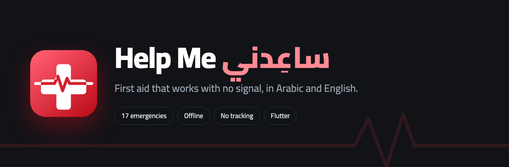
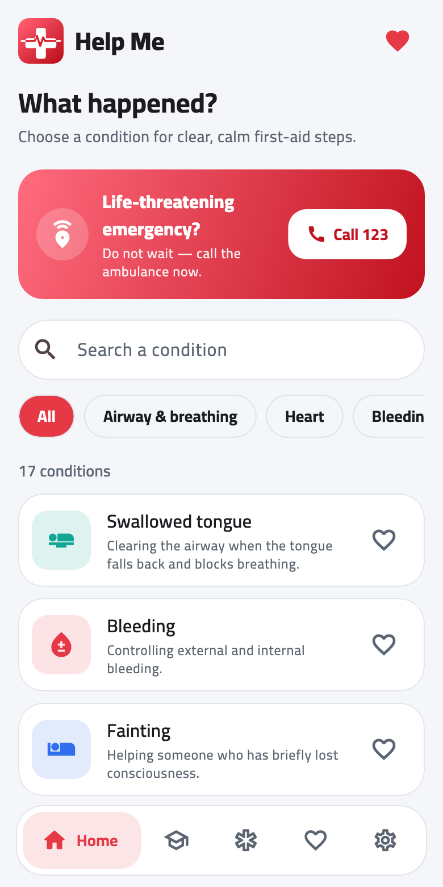
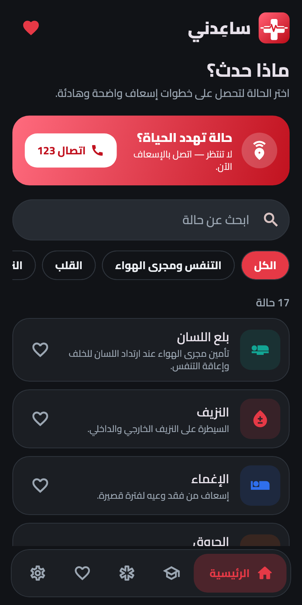
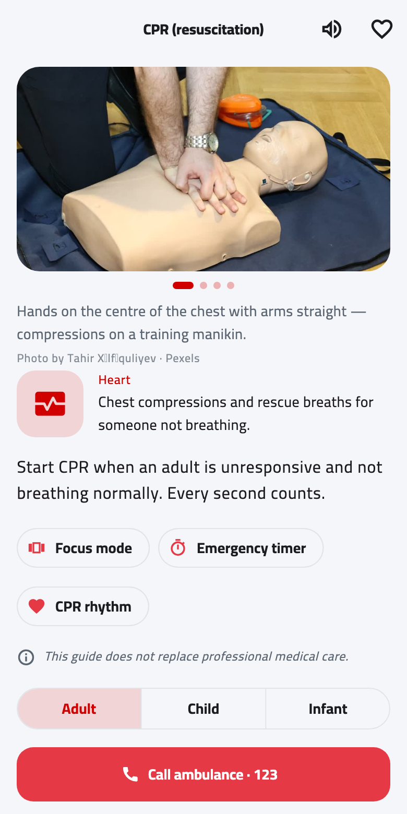
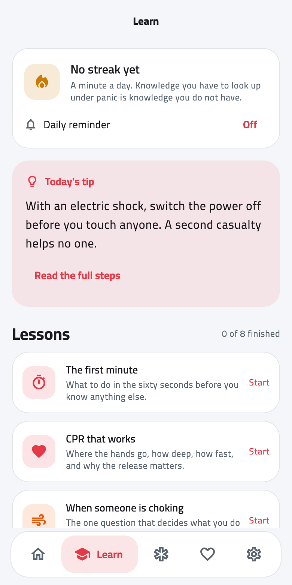
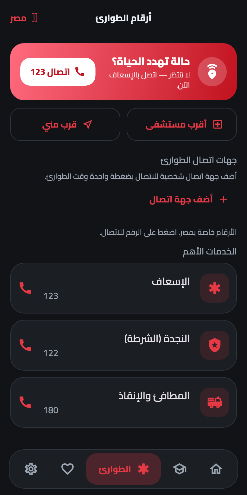
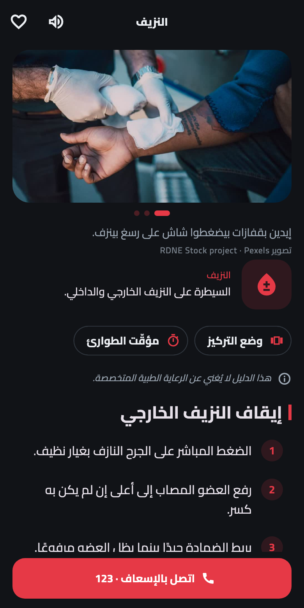

<div align="center">



<br />

[](https://flutter.dev)
[](https://dart.dev)
[](#quality)
[](analysis_options.yaml)
[](#offline-by-construction)
[](PRIVACY_POLICY.md)
[](LICENSE)

**A free, offline, bilingual first-aid and emergency guide for Android and iOS.**
**تطبيق إسعافات أولية مجاني يعمل دون إنترنت، بالعربية والإنجليزية.**

</div>

---

## Table of contents

[Overview](#overview--نظرة-عامة) ·
[Screenshots](#screenshots) ·
[What it does](#what-it-does) ·
[The 20 conditions](#the-20-conditions) ·
[Architecture](#architecture) ·
[Content as data](#content-as-data) ·
[Bilingual by construction](#bilingual-by-construction) ·
[Offline by construction](#offline-by-construction) ·
[Privacy & security](#privacy--security) ·
[Brand](#brand) ·
[Getting started](#getting-started) ·
[Quality](#quality) ·
[Project layout](#project-layout) ·
[Publishing](#publishing) ·
[Credits](#credits) ·
[License](#license)

---

## Overview · نظرة عامة

**English** — *Help Me* is a first-aid app for the minutes before help arrives. It gives clear,
calm, step-by-step guidance for 20 emergencies, works with the phone in aeroplane mode, and is
fully bilingual with correct right-to-left layout in Arabic. Around that emergency core it also
keeps the things you want *before* an emergency: a daily first-aid lesson, encrypted medical cards
for your family, a medicine cabinet that warns you before anything expires, and a first-aid kit
checklist.

**عربي** — «ساعِدني» تطبيق إسعافات أولية للدقائق التي تسبق وصول المساعدة. يقدّم خطوات واضحة وهادئة
لـ ٢٠ حالة طارئة، ويعمل والهاتف في وضع الطيران، وهو ثنائي اللغة بالكامل مع تخطيط صحيح من اليمين
لليسار في العربية. وحول هذا القلب الطارئ يحتفظ أيضًا بما تحتاجه *قبل* الطوارئ: درس إسعاف يومي،
وبطاقات طبية مشفّرة لعائلتك، وخزانة دواء تنبّهك قبل انتهاء الصلاحية، وقائمة مراجعة لحقيبة الإسعافات.

> [!WARNING]
> **Medical disclaimer · تنبيه طبي**
> This app is for **education only** and is **not** a substitute for professional medical care.
> In a real emergency, call your local emergency number immediately.
> التطبيق لأغراض تعليمية فقط ولا يُغني عن الرعاية الطبية المتخصصة؛ في الطوارئ اتصل برقم الطوارئ فورًا.
>
> First-aid guidance in this app follows widely taught standards and is deliberately conservative:
> where sources differ, it teaches the safer action.

---

## Screenshots

Every image below is rendered from the running widget tree by
[`test/tool/screenshots.dart`](test/tool/screenshots.dart) — they are the real screens, not mockups.

| Home — English, light | Home — العربية, dark | Condition — CPR |
| :---: | :---: | :---: |
|  |  |  |
| Search, categories, and a one-tap ambulance banner. | The same screen mirrored: layout, numerals and icons all flip. | A real photograph, then the diagram, then the steps. |

| Learn | Emergency — العربية | Condition — النزيف |
| :---: | :---: | :---: |
|  |  |  |
| A tip a day, eight lessons, a streak that never nags. | Country numbers, personal ICE contacts, "near me". | Dark theme, RTL, and the read-aloud control. |

Regenerate them after any UI change:

```bash
flutter test test/tool/screenshots.dart --update-goldens
```

---

## What it does

### In an emergency

| | |
| --- | --- |
| 🩹 **20 first-aid topics** | Each opens with what the emergency *looks* like, then what to *do*, then the steps — in the order a frightened person needs them. |
| 👶 **Child & infant mode** | CPR, choking, drowning, burns, anaphylaxis and seizures each carry the technique for that age — two fingers and 4 cm for a baby, chest thrusts instead of abdominal ones. A switch on the condition screen picks the age, always opening on **Adult** so it can never be left set to the wrong one. |
| 📷 **14 real photographs** | Bundled so they work offline, with the photographer credited on screen. Three topics carry none on purpose: no honest stock photo of choking, anaphylaxis or stroke recognition exists, and a photo that merely *looks* medical teaches the wrong thing. |
| 🖼️ **23 step illustrations** | Drawn for this app — hand position for CPR, the recovery position, abdominal thrusts, tourniquet placement. Original work, so no third-party copyright. |
| ▶️ **30 videos from recognised bodies** | St John Ambulance, the Red Cross, the American Heart Association (Arabic), Mayo Clinic and the NHS — played **inside the app**. Every id is verified against YouTube's public data, so the channel shown really did publish it. |
| ❤️ **CPR metronome** | A heartbeat pulse with a click and a haptic at 100–120 bpm — the rate you are meant to compress at. |
| 🔊 **Read-aloud** | The steps read out in the app's own language, following along step by step, so you can keep your hands on the casualty. |
| 🎯 **Focus mode** | One step, full screen, huge type. Nothing else on the display. |
| ⏱️ **Emergency timer** | For the things that are measured in minutes: cooling a burn, holding pressure. |
| ☎️ **ICE contacts** | Your own emergency contacts, callable in one tap. |
| 🌎 **Country numbers** | Egypt, Saudi Arabia, the UAE and an international fallback. |
| 📍 **Near me** | Hospitals, pharmacies, blood banks and clinics, opened in your own maps app. **No location permission is ever requested** — the search is handed to the maps app, which already has it. |

### Every other day

| | |
| --- | --- |
| 🎓 **Learn** | A daily first-aid tip drawn from a pool of 47, with no repeats within a month; eight short lessons; and a 16-question quiz that explains the reasoning behind every answer, right or wrong. |
| 🔥 **Streak & badges** | Deliberately gentle. It grows by turning up and quietly resets — no loss warnings, no guilt. |
| 🪪 **Medical cards** | Up to six people: blood type, allergies, conditions, medicines. The emergency view is high-contrast with large type and a plain-text QR code any paramedic can read with any camera — no app required at the other end. |
| 💊 **Medicine cabinet** | Warns 30 days before anything expires, with local daily dose reminders. |
| 🧰 **First-aid kit checklist** | 25 items with a readiness bar, so you find out what's missing before you need it. |
| 🩸 **Blood donation countdown** | 90 days from a recorded donation, with a nudge when you become eligible again. |

### Throughout

- **Fully bilingual** — Arabic and English, with correct RTL/LTR layout. Every medical step is
  translated; a build-time test fails if any string is missing on either side.
- **Works offline** — content, photographs, illustrations and fonts are all bundled. The network is
  used for exactly one thing: playing a video you chose to play.
- **Native on both platforms** — Cupertino pickers, sheets and dialogs on iOS; Material on Android.
- **Light, dark and system themes**, a language switch, and a one-time medical disclaimer.
- **Accessible** — semantic labels on every control, respects the system text scale, and the
  emergency surfaces are built for large type first rather than adapted to it.

---

## The 20 conditions

Grouped as the app groups them. The media column shows what each topic ships with.

| Category | Condition | الحالة | Photo | Diagram | Video |
| --- | --- | --- | :---: | :---: | :---: |
| Airway & breathing | Choking | الاختناق (الشرقة) | — | ✅ | ✅ |
| Airway & breathing | Swallowed tongue | بلع اللسان | ✅ | ✅ | ✅ |
| Heart | CPR (resuscitation) | الإنعاش القلبي الرئوي | ✅ | ✅ | ✅ |
| Heart | Heart attack | الأزمة القلبية | ✅ | ✅ | ✅ |
| Bleeding | Bleeding | النزيف | ✅ | ✅ | ✅ |
| Injuries | Burns | الحروق | ✅ | ✅ | ✅ |
| Injuries | Electric shock | الصعق الكهربائي | ✅ | ✅ | — |
| Injuries | Fractures | الكسور | ✅ | ✅ | ✅ |
| Environmental | Drowning | الغرق | ✅ | ✅ | — |
| Environmental | Heat stroke | ضربة الشمس | ✅ | ✅ | ✅ |
| Environmental | Snake bite | لدغة الثعبان | ✅ | ✅ | ✅ |
| Medical | Diabetic coma | غيبوبة السكر | ✅ | ✅ | ✅ |
| Medical | Epileptic seizures | نوبات الصرع | ✅ | ✅ | ✅ |
| Medical | Fainting | الإغماء | ✅ | ✅ | ✅ |
| Medical | Poisoning | التسمم | ✅ | ✅ | ✅ |
| Medical | Severe allergic reaction | الحساسية الشديدة | — | ✅ | ✅ |
| Medical | Stroke | الجلطة الدماغية | — | ✅ | ✅ |

Every topic carries a diagram. Three carry no photograph on purpose, and two have no video
because no verified upload from a recognised body covers them.

---

## Architecture

The app is a single Flutter target with a layered, feature-first structure. Nothing in `features/`
reaches into another feature; anything shared moves down into `core/`, and anything stateful lives
in a Riverpod provider rather than in a widget.

```
┌──────────────────────────────────────────────────────────────┐
│  features/   screens & widgets — one folder per product area │
│              home · conditions · learn · health · emergency  │
│              nearby · favorites · settings · about · splash  │
├──────────────────────────────────────────────────────────────┤
│  providers/  Riverpod state: settings, favorites, search,    │
│              health, learn, country, contacts, reminders     │
├──────────────────────────────────────────────────────────────┤
│  services/   side effects at the edges: encrypted store,     │
│              notification scheduling, quick actions          │
├──────────────────────────────────────────────────────────────┤
│  core/       shared, feature-agnostic: LocalizedText, media, │
│              speech, dialer, maps, platform-adaptive widgets │
├──────────────────────────────────────────────────────────────┤
│  app/        MaterialApp, theme, and the five-tab shell      │
└──────────────────────────────────────────────────────────────┘
```

| Area | Choice | Why |
| --- | --- | --- |
| Framework | Flutter 3.41 · Dart 3 · Material 3 | One codebase, two stores, real native feel on both. |
| State | [Riverpod](https://riverpod.dev) `Notifier` / `Provider` | Testable without a widget tree; every provider is overridable in tests. |
| Persistence | `shared_preferences` | Theme, language, favorites, streak, disclaimer — none of it sensitive. |
| Secure persistence | `flutter_secure_storage` | Health data only: iOS Keychain, Android EncryptedSharedPreferences. |
| Localization | Flutter `gen_l10n` (UI) + typed `LocalizedText` (content) | See [Bilingual by construction](#bilingual-by-construction). |
| Notifications | `flutter_local_notifications` + `timezone` | Scheduled entirely on-device; no push service, no server. |
| Video | `youtube_player_iframe` | In-app playback with no API key and no account. |
| Speech | `flutter_tts` | Reads the steps aloud in the app's current language. |
| Platform glue | `url_launcher` · `share_plus` · `in_app_review` · `qr_flutter` · `quick_actions` | Calling, sharing, rating, QR codes, home-screen shortcuts. |
| Branding | One SVG → every icon | See [Brand](#brand). |
| Font | Cairo, bundled (SIL OFL) | Reads well in both scripts; ships with the app so it works offline. |

---

## Content as data

The 20 topics are **data, not screens**. One immutable catalogue feeds the home list, search,
favorites, the detail screen, the read-aloud, and focus mode:

```dart
const FirstAidTopic(
  id: 'cpr',
  title: LocalizedText(en: 'CPR (resuscitation)', ar: 'الإنعاش القلبي الرئوي'),
  summary: LocalizedText(
    en: 'Chest compressions and rescue breaths for someone not breathing.',
    ar: 'ضغطات الصدر والتنفس الإنقاذي لمن توقف تنفسه.',
  ),
  category: TopicCategory.cardiac,
  sections: <FirstAidSection>[ /* … steps and callouts … */ ],
);
```

Adding a condition is a single entry in the catalogue plus its media — **no new UI code**, and the
tests below will immediately hold it to the same standard as every other topic (bilingual, unique
id, non-empty steps, illustrations that actually exist on disk).

---

## Bilingual by construction

Two mechanisms, deliberately kept apart:

- **UI chrome** — ARB files (`lib/l10n/app_en.arb`, `app_ar.arb`) compiled by `gen_l10n`. Buttons,
  labels, and screen titles.
- **Medical content** — a typed `LocalizedText(en:, ar:)` value. Both languages sit side by side in
  the same declaration, so a translation can't silently drift away from the text it belongs to.

`LocalizedText.isComplete` is asserted across every catalogue in the test suite. A step, callout,
tip, lesson, quiz answer or kit item with a missing Arabic or English string **fails the build**.

RTL is real, not a mirror trick: the layout, the nav bar, the numerals and the icon directions all
flip, and there is a golden test that renders the nav bar right-to-left to prove it.

---

## Offline by construction

Everything the app needs in an emergency is in the bundle:

- All 20 topics and their steps — compiled into the binary as Dart data.
- 14 photographs, 23 step illustrations, 6 category illustrations.
- The Cairo font in five weights.
- Emergency numbers for four regions.

The only network call in the app is a video you tapped. Nothing is fetched at launch, there is no
API, no backend, and no configuration to download — so the app behaves identically on a dead
signal, on aeroplane mode, and in a basement.

---

## Privacy & security

- **No account, no analytics, no ads, no tracking, no telemetry.** There is no server to send
  anything to.
- **Health data is encrypted on-device** — iOS Keychain, Android EncryptedSharedPreferences — and
  never leaves the phone. Not backed up to us, because there is no us.
- **No location permission is ever requested.** "Near me" hands a search to your maps app, which
  already has the permission and the user's trust.
- **Notifications are scheduled locally.** No push token, no notification service.
- The emergency QR code is **plain text**, so it works with any camera and needs no app or network
  at the receiving end.

Full policy: [`PRIVACY_POLICY.md`](PRIVACY_POLICY.md).

---

## Brand


The mark is a first-aid cross with an ECG trace cut through it — red inside the cross, white
outside, so the line reads as one continuous signal running edge to edge. It was chosen over a
heart because it is the only shape that still says *first aid* at 22 pixels, and because a **red
cross on a white ground is the emblem of the Red Cross**, protected by the Geneva Conventions;
both Apple and Google reject apps that use it. Keeping the mark white-on-red carries none of that
restriction.

<br clear="left" />

| Token | Value | Used for |
| --- | --- | --- |
| `emergencyRed` | `#E63946` | Primary seed colour, SOS surfaces |
| `emergencyRedBright` | `#FF6B7E` | Gradient start |
| `emergencyRedDeep` | `#C1121F` | Gradient end, pressed states |
| `medicalTeal` | `#1D9A8A` | Calm/secondary accent |
| `lightBackground` / `darkBackground` | `#F5F6F9` / `#111317` | App ground |
| Type | Cairo 400–800 | One family, both scripts |

**Everything is generated from vector.** The SVGs in [`assets/branding/`](assets/branding/) are the
source of truth; every PNG in the repository is output. To change the mark, edit the SVG and run:

```bash
tool/render_branding.sh              # SVG → 1024px PNGs (needs Chrome)
dart run flutter_launcher_icons      # → iOS set, Android adaptive + monochrome, web icons
dart run flutter_native_splash:create # → light & dark native splash
```

| File | Produces |
| --- | --- |
| `icon_full.svg` | The iOS icon set and the web icons (full-bleed square; the platform applies its own mask). |
| `logo.svg` | The rounded mark used in-app by `AppLogo` — splash, home header, about, disclaimer. |
| `icon_foreground.svg` + `icon_background.svg` | The two Android adaptive layers, so the gradient matches iOS instead of flattening to one colour. |
| `icon_monochrome.svg` | The Android 13+ themed icon, with the pulse knocked out so the launcher can tint a single silhouette. |

---

## Getting started

**Requirements** — Flutter ≥ 3.4 (developed on 3.41), JDK 17+ for Android, Xcode 15+ for iOS.

```bash
git clone https://github.com/aymanaboelela/Help-Me-App.git
cd Help-Me-App
flutter pub get
flutter gen-l10n        # generates AppLocalizations (also runs on build)
flutter run
```

**Android toolchain** — AGP 8.9.1 · Gradle 8.11.1 · Kotlin 2.2.20.

**Release builds**

```bash
flutter build appbundle --release   # Google Play
flutter build ipa --release         # App Store
```

Signing needs the owner's keystore and Apple account — see
[`store/PUBLISHING.md`](store/PUBLISHING.md).

---

## Quality

```bash
flutter analyze     # 0 issues — strict lints, see analysis_options.yaml
flutter test        # 213 tests
```

The suite is written Given–When–Then and is deliberately weighted towards the things that would
actually hurt someone if they broke:

| Area | What is asserted |
| --- | --- |
| **Content integrity** | Every topic, tip, lesson, quiz question and kit item has a unique id and complete Arabic **and** English text. Empty steps fail. |
| **Media** | Every referenced illustration exists on disk; every video id is well-formed and listed once; language ordering is correct. |
| **Providers** | Search, favorites, settings, country selection, streak and badge logic, blood-donation eligibility. |
| **Health** | Medicine expiry maths, medical card round-trips through the encrypted store, kit readiness. |
| **Reminders** | Reminder planning runs through a fake, so no real notification is ever scheduled by a test. |
| **Widgets** | Home, health and condition screens build and respond; RTL rendering is exercised, not assumed. |
| **Goldens** | The navigation bar (light, dark, RTL) and the condition gallery are rendered to images and compared. |

Golden images live in [`test/goldens/`](test/goldens/); update them deliberately with
`flutter test --update-goldens` and **look at the diff** before committing.

---

## Project layout

```
lib/
├── main.dart                    # bootstrap: preferences, encrypted health store, timezone
├── app/
│   ├── app.dart                 # MaterialApp, locale & theme wiring
│   ├── root_scaffold.dart       # the five-tab shell + first-launch disclaimer
│   └── theme/                   # colours, semantic tokens, typography
├── core/
│   ├── localized_text.dart      # the bilingual value type
│   ├── media/                   # topic photo / illustration / video model
│   ├── platform/                # Cupertino-vs-Material adaptive widgets
│   ├── widgets/                 # AppLogo, AppNavBar, SosBanner, TopicCard, CalloutBox
│   ├── speech.dart · speech_text.dart   # TTS + text normalisation for both languages
│   └── dialer.dart · maps.dart · call_action.dart
├── l10n/                        # app_en.arb · app_ar.arb (+ generated)
├── features/
│   ├── splash · home · favorites · settings · about
│   ├── conditions/              # 20 topics, media catalogue, detail screen
│   ├── learn/                   # daily tip · 8 lessons · 16-question quiz
│   ├── health/                  # medical cards · medicines · first-aid kit
│   ├── nearby/                  # maps handoff + blood-donation countdown
│   ├── emergency/               # country numbers + ICE contacts
│   └── tools/                   # CPR metronome · emergency timer · focus mode
├── providers/                   # Riverpod state
└── services/                    # secure store · reminders · quick actions

assets/branding/                 # SVG sources + generated 1024px PNGs
assets/photos/ · steps/ · illustrations/ · fonts/
docs/screenshots/                # generated by test/tool/screenshots.dart
store/                           # Play & App Store listing copy (AR + EN) + checklist
tool/                            # render_branding.sh — SVG → PNG rasteriser
test/                            # 213 tests + goldens + tool/screenshots.dart
```

---

## Publishing

Configured for both stores under **`com.helpme.help`**, version **`2.0.0 (build 7)`**, with
generated icons, native splash screens, and localized app names (*Help Me* / *ساعِدني*).

- Listing copy, Arabic and English: [`store/listing_ar.md`](store/listing_ar.md) ·
  [`store/listing_en.md`](store/listing_en.md)
- Step-by-step release checklist: [`store/PUBLISHING.md`](store/PUBLISHING.md)
- Privacy policy to link from both consoles: [`PRIVACY_POLICY.md`](PRIVACY_POLICY.md)

Actual submission needs the owner's Apple Developer and Google Play accounts and a signing
keystore — everything else is already in place.

---

## Credits

- Original concept: **Ayman Abo El Ela**. Original UI: Salma Salama.
- 2.0 rebuild: new architecture, brand, bilingual content, expanded first-aid topics, and tests.
- First-aid guidance follows widely taught standards (St John Ambulance, the Red Cross, the
  American Heart Association, the NHS) and is intentionally conservative.
- Photographs from [Pexels](https://pexels.com), bundled under the Pexels licence with each
  photographer credited in the app and in [`assets/CREDITS.md`](assets/CREDITS.md).
- Category illustrations from [unDraw](https://undraw.co), recoloured to each category's accent.
  Step illustrations are original work for this app.
- Videos are **linked, not hosted**, and belong to the organisations that published them.
- Cairo font © The Cairo Project Authors, [SIL Open Font License 1.1](assets/fonts/OFL.txt).

---

## License

Application code is released under the MIT License — see [`LICENSE`](LICENSE).

Bundled third-party assets keep their own licences: the Cairo font under the SIL OFL, unDraw
illustrations under the unDraw licence, and photographs under the Pexels licence. See
[`assets/CREDITS.md`](assets/CREDITS.md).

<div align="center">
<br />
<sub>Built so that the minute before the ambulance arrives is not a wasted one.</sub>
</div>
